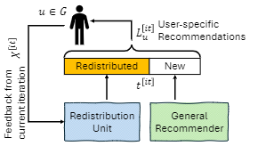

# Consensus Evaluation Framework (Paper Version)

This repository contains the experimental framework used for group consensus evaluation on MovieLens data, focused on:

- async mediators,
- sync mediators,
- hybrid mediators,
- RFC/NDCG-style evaluation outputs and LaTeX table generation.

The core implementation is in `evaluation_frameworks/consensus_evaluation`.

## Framework Overview



High-resolution PDF version: [docs/consensus_framework.pdf](docs/consensus_framework.pdf)

At a high level:

- a **General Recommender** provides candidate items,
- a **Redistribution Unit** adapts ranking according to group interaction state,
- users provide iterative feedback in rounds,
- evaluator scripts measure convergence quality (e.g., rounds to consensus, success ratio, NDCG diagnostics).

## Repository Layout

- `evaluation_frameworks/consensus_evaluation/` — mediators, synthetic groups, evaluation pipeline (see [evaluation_frameworks/consensus_evaluation/README.md](evaluation_frameworks/consensus_evaluation/README.md))
- `evaluation_frameworks/general_recommender_evaluation/` — standalone MovieLens / Surprise rating experiments (EASEr, SVD, iterators); not wired into `run_consensus.sh`
- `dataset/` — dataset loading and sparse cache usage for MovieLens pipelines (see `dataset/README.md`)
- `utils/` — shared config/cache helpers (including `load_or_build_pickle`)
- `cache/cons_evaluations/` — evaluation outputs used by reporting scripts
- `run_consensus.sh` — single entry for full/parallel/tune/debug eval (see `./run_consensus.sh help` or `make consensus-help`)
- `Makefile` — `consensus-*` wrappers around `run_consensus.sh`, plus many per-module `eval_*` / `tune_*` / `table_*` targets
- `eval_notify.sh` — optional logging hook used by `run_consensus.sh eval-suite`
- `unit_tests/` — targeted tests for mediator logic

## Makefile and `./run_consensus.sh`

Paper-scale runs are driven by **`./run_consensus.sh`** from the repository root. **`make consensus-*`** targets are thin wrappers that call the same script (they require **`bash`** in `PATH`).

On **Windows**, use **Git Bash**, **MSYS2**, or **WSL** so `./run_consensus.sh` and `make consensus-eval-full` work as written; plain PowerShell does not run the script natively.

| `make` target | Underlying command |
|---------------|-------------------|
| `consensus-help` | `./run_consensus.sh help` |
| `consensus-eval-full` | `./run_consensus.sh eval-full` |
| `consensus-eval-parallel` | `./run_consensus.sh eval-parallel-seeded` |
| `consensus-eval-w1w3` | `./run_consensus.sh eval-w1-w3-isolated` |
| `consensus-tune-hybrid` | `./run_consensus.sh tune-hybrid` |
| `consensus-eval-phased` | `./run_consensus.sh eval-phased` |
| `consensus-eval-debug` | `./run_consensus.sh eval-debug-one` |
| `consensus-eval-suite` | `./run_consensus.sh eval-suite` |
| `consensus-sync-gcp` | `./run_consensus.sh sync-gcp` |

**Single-module runs** (one algorithm, one window, tuning sweeps, LaTeX table generators) still use **`Makefile`** targets such as `eval_async_static_policy_simple_priority_function_individual_rec`, `tune_hybrid_all_params`, `table_ndcg_comparisions`, and so on. Inspect the exact Python invocation with `make -n <target>`. Common variables: `MODE` (`auto` / `compute` / `load`), `W` (consensus window), `GROUPS_COUNT`, `GROUP_SIZE` (large-group evals), `K` (NDCG tables).

### Paper `eval-full` / `eval-parallel-seeded` module set

These orchestration modes iterate **windows × population biases × group types** and run the same **seven** evaluation modules (see `run_consensus.sh`, arrays `EVAL_MODULES`):

1. **Async + sigmoid, individual recommender** — `eval_async_with_sigmoid_policy_simple_priority_individual_rec`
2. **Async static policy, individual** — `eval_async_static_policy_simple_priority_function_individual_rec`
3. **Async static policy, group recommender** — `eval_async_static_policy_simple_priority_function_group_rec`
4. **Sync, no feedback** — `eval_sync_without_feedback`
5. **Sync + feedback (EMA)** — `eval_sync_with_feedback_ema`
6. **Hybrid, general individual recommender** — `eval_hybrid_general_rec_individual`
7. **Hybrid, updatable** — `eval_hybrid_updatable`

`eval-phased` runs a **smaller module set** at `PHASE1_W`, then the **full seven-module set** at `PHASE2_W` (see `run_consensus.sh`). `eval-suite` runs one pass over the same seven modules with optional `eval_notify.sh` logging. **Larger-group** and **extra** experiments are only via dedicated `Makefile` targets / modules under `evaluation_frameworks/consensus_evaluation/evaluation/evaluations/larger_group_evaluations/` and `.../other_evaluations/`, not the default `eval-full` list.

## Quick Start

### 1) Environment

```bash
python3 -m venv venv
source venv/bin/activate
python -m pip install -r requirements.txt
```

After setup, a quick sanity check (stdlib `unittest` only):

```bash
python -m unittest discover -s unit_tests -p "test_*.py"
```

### 1.1) Dataset note (important)

This repository does not track large MovieLens 32M raw/cache files in Git.

- Read `dataset/README.md` for expected local files.
- Download the dataset locally and place it under `dataset/dataset/ml-32m/` before running full evaluations.

### 2) One-shot full evaluation (single workspace)

```bash
CONS_EVAL_WORKERS=8 GROUPS_COUNT=1000 EVAL_WINDOWS="1 3 5 10" POPULATION_BIASES="0 1 2" ./run_consensus.sh eval-full
```

### 3) High-throughput isolated parallel run (recommended on multi-core VM)

```bash
SEED_FIRST=1 RUNS_ROOT=/dev/shm/analysis_runs EVAL_WINDOWS="1 3" POPULATION_BIASES="0 1 2" GROUPS_COUNT=1000 PARALLEL_JOBS=5 WORKERS_PER_JOB=20 ./run_consensus.sh eval-parallel-seeded
```

Why isolated runs matter:

- each job gets its own workspace/cache,
- parallel processes do not write to the same pickle path,
- avoids `pickle data was truncated` race-condition failures.

## Evaluation Flow

1. **Dataset preparation / context load**
   - sparse ratings + filtered dataset context
2. **Group set loading**
   - similar/outlier/random (+ optional divergent/variance variants)
3. **Recommendation model loading**
   - Easer/SVD loaded from cache or trained once and cached
4. **Round-based simulation**
   - feedback loop with mediator policy
5. **Metrics + persistence**
   - results persisted under `cache/cons_evaluations/...`
6. **Reporting**
   - export + LaTeX table scripts in `evaluation_frameworks/consensus_evaluation/evaluation/evaluations/print/`

## Adding a New Evaluation Script

Create a new module under:

- `evaluation_frameworks/consensus_evaluation/evaluation/evaluations/`

Recommended pattern:

1. Define an experiment class compatible with existing evaluation modules.
2. Reuse `Runner`/context factory utilities instead of custom data-loading logic.
3. Expose CLI via existing `autorun(...)` pattern from `evaluations/config.py`.
4. Keep output keys consistent with current result schema so print/export scripts can consume it.
5. Add module entry to `run_consensus.sh` (`cmd_eval_full` / `cmd_eval_parallel_seeded` module lists).

Minimal checklist for compatibility:

- accepts `--window-size`, `--groups-count`, `--population-biases`, `--group-types`, `--ndcg-k`
- saves results into the existing `cons_evaluations` layout
- does not write to globally shared ad-hoc cache paths

## Redistribution unit

The redistribution unit is the adaptive block between recommendation candidates and user-visible ordering. It is responsible for:

- incorporating current round feedback,
- balancing exploitation vs. exploration under mediator policy,
- producing updated item ranking for the next interaction round.

Implementation references:

- `evaluation_frameworks/consensus_evaluation/consensus_algorithm/redistribution_unit.py`
- related mediator orchestration in `evaluation_frameworks/consensus_evaluation/consensus_mediator.py`

## Reproducibility Notes

- Keep `POPULATION_BIASES`, `EVAL_WINDOWS`, `GROUPS_COUNT`, and `group-types` fixed across compared algorithms.
- Prefer one dedicated cache build before long runs.
- On large VMs, use isolated parallel orchestration script with `/dev/shm` if disk I/O or disk size is limiting.
- Do not run multiple non-isolated full eval scripts in the same workspace.
- Keep large local dataset/cache artifacts out of Git (already enforced by `.gitignore`).

## Common Issues

- **`pickle data was truncated`**  
  Usually caused by interrupted or concurrent write to shared pickle. Rebuild the affected file and use isolated parallel workspaces.

- **`No space left on device`**  
  Increase disk or run isolated workspaces under `/dev/shm` when RAM allows.

- **`ModuleNotFoundError` for dataset modules**  
  Verify the expected `movies_data` paths exist and were synced.

## License / Usage

This repository is prepared for academic reproducibility of the associated paper experiments. Add or update `LICENSE` before public release if required by your institution.
